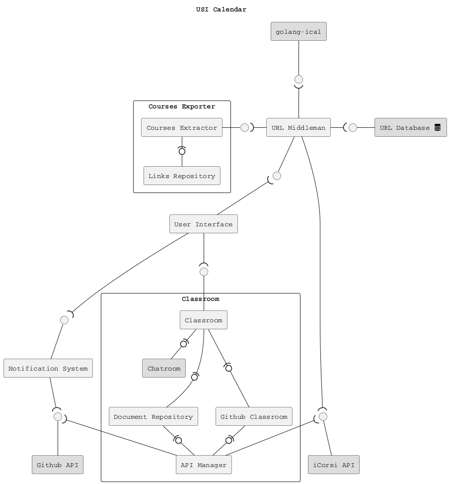
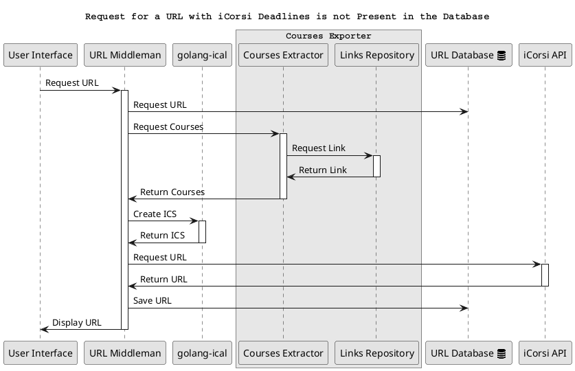
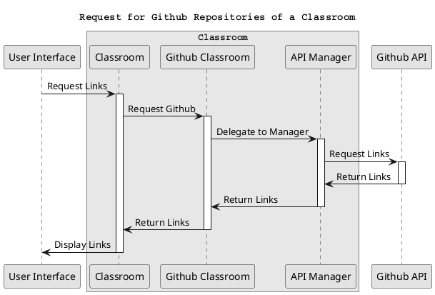
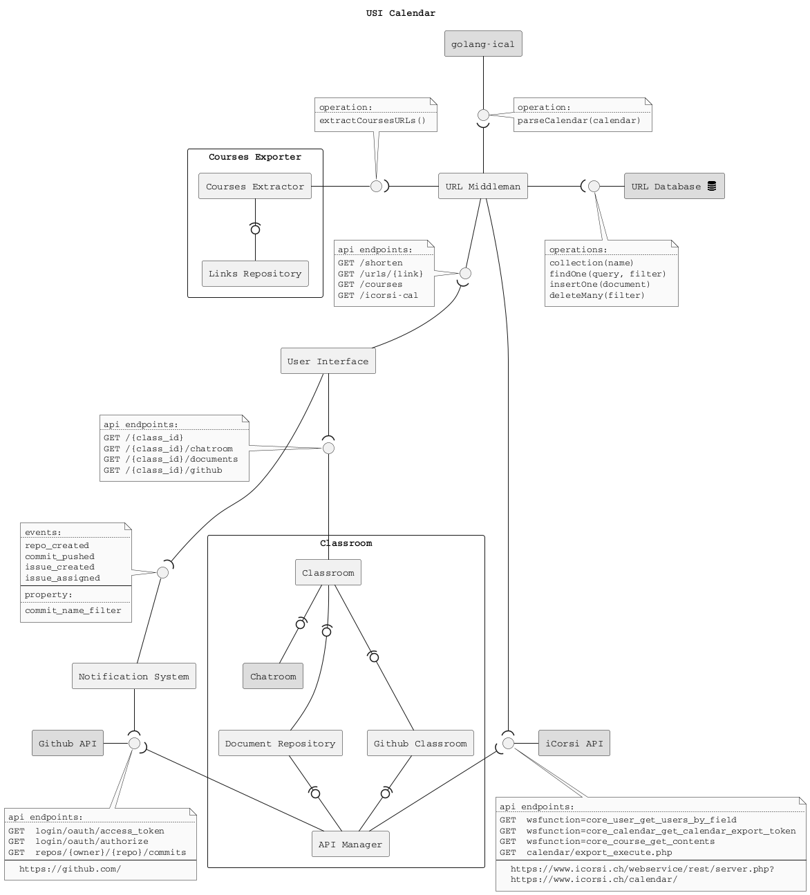

lecture: 
Software Architecture
---
title: 
USI Calendar
---
author:
Edoardo Riggio
---
 
# Getting started

You will use [Markdown](https://www.markdownguide.org/cheat-sheetplan), [PlantUML](https://plantuml.com/), [architectural decision records](https://github.com/adr/madr), feature models and connector views to describe a software architecture model about your own project.

This document will grow during the semester as you sketch and refine your software architecture model.

When you are done with each task, please push so we can give you feedback about your work.

We begin by selecting a suitable project domain.


# Ex - Domain Selection 

{.instructions

Submit the name and brief description (about 100 words) of your domain using the following vision statement template:

```
For [target customers]
Who [need/opportunity/problem]
The [name your project]
Is  [type of project]
That [major features, core benefits, compelling reason to buy]
Unlike [current reality or competitors]
Our Project [summarize main advantages over status quo, unique selling point]
```

Please indicate if your choice is:

* a project you have worked on in the past (by yourself or with a team)
* a project you are going to work on this semester in another lecture (which one?)
* a new project you plan to build in the future
* some existing open source project you are interested to contribute to

The chosen domain should be unique for each student.

Please be ready to give a 2 minute presentation about it (you can use one slide but it's not necessary)

Hint: to choose a meaningful project look at the rest of the modeling tasks which you are going to perform in the context of your domain.

}

Project Name: *USI Calendar*

Project Type: Project I have worked on in the past

Vision Statement: This project is for USI students and is called USI Calendar. Students can – as of now – download the calendar of the current semester's courses from USI's website. The problem with this solution is that it is not possible for students to choose which courses to include in the calendar, and which to exclude. USI Calendar aims at giving the possibility to users to be able to choose and display in their calendar their own courses. Moreover, USI Calendar will create "classrooms" for each course. In these classrooms students will be automatically added based on the courses they chose to include in their calendars.

Additional Information:


# Ex - Architectural Decision Records

{.instructions

Software architecture is about making design decisions that will impact the quality of the software you plan to build.

Let's practice how to describe an architectural decision. We will keep using ADRs to document architectural decisions in the rest of the model.

Use the following template to capture one or more architectural design decisions in the context of your project domain

Pass: 1 ADR

Good: 2 ADR

Exceed: >2 ADR

}


# Ex - Quality Attribute Scenario

{.instructions

1. Pick a scenario for a specific quality attribute. Describe it with natural language.

2. Refine the scenario using the following structure:


*Stimulus*: condition affecting the system

*Source*: entity generating the stimulus

*Environment*: context under which stimulus occurred (e.g., build, test, deployment, startup, normal operation, overload, failure, attack, change)

*Response*: observable result of the stimulus

*Measure*: benchmark or target value defining a successful response

Pass: 3 scenarios

Good: >3 scenarios

Exceed: >6 scenarios using challenging qualities

}


## Scenario #1

Quality: _Testability_

Scenario: In the case of a new release being pushed, it must have a code coverage of at least 90% and pass all tests before being deployed.


## Scenario #2

Quality: _Deployability_

Scenario: If all tests pass and the code coverage is at least 90%, the release can be deployed on the production server.


## Scenario #3

Quality: _Recoverability_

Scenario: After maintenance work, the server must come back online in less than 1 minute.


## Scenario #4

Quality: _Authentication_

Scenario: If a user is authenticated, it must be logged out automatically after 30 minutes of inactivity.


## Scenario #5

Quality: _Durability_

Scenario: If the shortened URL hasn't been used for at least 1 week, remove it from the database.


## Scenario #6

Quality: _Composability_

Scenario: When all components are ready, they are composed by means of a docker compose files into 2 separate docker images, one for the backend and one for the frontend.


## Scenario #7

Quality: _Performance_

Scenario: If a user tries to access the website, this should load and be ready to use in less than 1 second.


# Ex - Quality Attribute Tradeoff

{.instructions

Pick a free combination of two qualities on the [map](https://usi365.sharepoint.com/:x:/s/MSDE2023-SoftwareArchitecture/EbK1lRTVOUZJhQoz0XdUBwIBd5vd5yQblOaOwYze4ovbuA?e=6aexs6) and write your name to claim it.

Then write a short text giving an example for the tradeoff in this assignment.

Pass: 1 unique trade-off

Good: 2 trade-offs

Exceed: >2 trade-offs

}

## Usability vs. Complexity

By making the service usable, we want as many people as possible to be able to use it with little to none prior knowledge. However, this would mean that advanced features cannot be developed. On the other hand, we can develop more advanced features, filtering methods etc., but then the system becomes less usable and users would be required to have some previous knowledge of the domain.

## Durability vs. Performance

If we wanted to save in the server all the URLs generated by the users, then this would mean that increasing the number of users will in turn increase the number of URLs in the server, which in turn will lead to a degradation of the performance of the service itself. On the other hand, by saving just the most frequent URLs, this would lead to an improvement in the performance of the service.

## Customizability vs. Design Consistency

Developing a platform that can be used by any university for their calendars and classrooms would be great, but this would lead to inexistent design consistency, since every university could possibly change some sections to whatever they prefer. Making the website design consistent, on the other hand, would lead to the possibility of making the website only available to USI (similarly to what happens with iCorsi).


# Ex - Feature Modeling

{.instructions

In the context of your chosen project domain, describe your domain using a feature model.

The feature model should be correctly visualized using the following template:


If possible, make use of all modeling constructs.

Pass: Include at least 4 non-trivial features

Good: Include at least 6 non-trivial features, which are all implemented by your project

Exceed: Include more than 8 non-trivial features, indicate which are found in your project and which belong to one competitor

}


<br/>

The feature that belongs to a "competitor" (i.e. USI), is the generation of the calendars with all courses of a program. All the other features are only found in the USI Calendar project.


# Ex - Context Diagram

{.instructions

Prepare a context diagram to define the design boundary for your project.

Here is a PlantUML/C4 example to get started.


Make sure to include all possible user personas and external dependencies you may need.

Pass: 1 User and 1 Dependency

Good: >1 User and >1 Dependency

Exceed: >1 User and >1 Dependency, with both incoming and outgoing dependencies

}


# Ex - Component Model: Top-Down

{.instructions

Within the context of your project domain, represent a model of your modular software architecture decomposed into components.

The number of components in your logical view should be between 6 and 9:

- At least one component should be further decomposed into sub components
- At least one component should already exist. You should plan how to reuse it, by locating it in some software repository and including in your model the exact link to its specification and its price.
- At least one component should be stateful.

The logical view should represent provide/require dependencies that are consistent with the interactions represented in the process view.

The process view should illustrate how the proposed decomposition is used to satisfy the main use case given by your domain model.

You can add additional process views showing how other use cases can be satisfied by the same set of components.

This assignment will focus on modularity-related decisions, we will worry about deployment and the container view later.

Here is a PlantUML example logical view and process view.


Hint: How to connect sub-components to other external components? Use this pattern.


Pass: 6 components (1 decomposed), 1 use case/process view

Good: 6 components (1 decomposed), 2 use case/process view

Exceed: >6 components (>1 decomposed) and >2 use case/process view

}

## Logical View


## Process Views

### Use Case #1:


### Use Case #2:


# Ex - Component Model: Bottom-Up

{.instructions

Within the context of your project domain, represent a model of your modular software architecture decomposed into components.

To design this model you should attempt to buy and reuse as many components as possible.

In addition to the logical and process views, you should give a precise list to all sources and prices of the components you have selected to be reused.

Write an ADR to document your component selection process (indicating which alternatives were considered).

Pass: Existing design with at least 1 reused components (1 Logical View, 1 Process View)

Good: Existing design with at least 3 reused components (1 Logical View, 1 Process View, 1 ADR)

Exceed: Redesign based on >3 reused components (1 Logical View, >1 Process View, >1 ADR)

}

## Logical View



### External Components:
**golang-ical**: https://github.com/JacopoD/golang-ical

**URL Database**: https://www.mongodb.com/atlas/database

**Chatroom**: https://minnit.chat/

**iCorsi API**: https://moodledev.io/docs/apis

**Github API**: https://docs.github.com/en/rest?apiVersion=2022-11-28

## Process Views

### Use Case #1:



### Use Case #2:




# Ex - Interface/API Specification

{.instructions

In this iteration, we will detail your previous model to specify the provided interface of all components based on their interactions found in your existing process views.

1. choose whether to use the top down or bottom up model. If you specify the interfaces of the bottom up model, your interface descriptions should match what the components you reuse already offer.

2. decide which interface elements are operations, properties, or events.

Get started with one of these PlantUML templates, or you can come up with your own notation to describe the interfaces, as long as it includes all the necessary details.

The first template describes separately the provided/required interfaces of each component. 


The second template annotates the logical view with the interface descriptions: less redundant, but needs the logical dependencies to be modeled to show which are the required interfaces.


Pass: define interfaces of all outer-level components

Good: Define interfaces of all outer-level components. Does your architecture publish a Web API? If not, extend it so that it does. 

Exceed: Also, document the Web API using the OpenAPI language. You can use the [OpenAPI-to-Tree](http://api-ace.inf.usi.ch/openapi-to-tree/) tool to visualize the structure of your OpenAPI description.

}

## Interface Specification



## OpenAPI Specification


# Ex - Connector View

{.instructions

Extend your existing models introducing the connector view

For every pair of connected components (logical view), pick the most suitable connector. Existing components can play the role of connector, or new connectors may need to be introduced.


Make sure that the interactions shown in the process views reflect the primitives of the selected connector

Pass: model existing connectors based on previous model decisions

Good: model existing connectors based on previous model decisions, write an ADR about the choice of one connector

Exceed: introduce a new type of connector and update your existing process view 
(sequence diagram) to show the connector primitives in action

}

## Connector View


## Process View

```puml
@startuml
title Run the Garbage Collector once and delete the URL named URL_x

''' PARTICIPANTS
participant "Database" as DB
participant "URL Middleman" as UMM
participant "Job Scheduler" as JS
participant "Garbage Collector" as GC


''' CONNECTIONS
GC -> JS: schedule(1 week, clean)
JS -> UMM: perform(clean)
UMM -> DB: delete(URL_x)


skinparam monochrome true
skinparam shadowing false
skinparam defaultFontName Courier
@enduml
```


# Ex - Adapters and Coupling

{.instructions

1. Highlight the connectors (or components) in your existing bottom-up design playing the role of adapter. (We suggest to use the bottom-up design since when dealing with externally sourced components, their interfaces can be a source of mismatches).
2. Which kind of mismatch** are they solving?
3. Introduce a wrapper in your architecture to hide one of the previously highlighted adapters
4. Where would standard interfaces play a role in your architecture? Which standards could be relevant in your domain?
5. Explain how one or more pairs of components are coupled according to different coupling facets
6. Provide more details on how each adapter solves the mismatches identified using pseudo-code or the actual code
7. How can you improve your architectural model to minimize coupling between components? (Include a revised logical/connector view with your solution)

Pass: 1-5 (with one adapter)

Good: 1-6 (with at least two adapters)

Exceed: 1-7 (with at least two adapters)

** If you do not find any mismatch in your existing design we suggest to introduce one artificially.

## Hints

* (1) Should we find cases where two components cannot communicate (and are doing it wrongly) and highlight they would need an adapter?, or cases where we have already a "component playing the role of adapter in the view" and highlight only the adapter?

  *Both are fine. We assumed that if you draw a dependency (or a connector) the interfaces match, but if you detect that the components that should communicate cannot communicate then of course introduce an adapter to solve the mismatch*

* (2) Please show the details about the two interfaces which do not match (e.g., names of parameters, object structures) so that it becomes clear why an adapter is needed and what the adapter should do to bridge the mismatch

* (5-6) These questions are about the implications on coupling based on the decisions you documented in the connector view.
Whenever you have a connector you couple together the components and different connectors will have different forms of coupling

  For example, if you use calls everywhere, do you really need them everywhere? is there some pair of components where you could use a message queue instead?

  Regarding the coupling facets mentioned in question 5. You do not have to answer all questions related to "discovery", "session", "binding", "interaction", "timing", "interface" and "platform" (p.441, Coupling Facets). Just the ones that you think are relevant for your design and by answering them you can get ideas on how to do question 6.

}

## Logical View

```puml
@startuml
skinparam componentStyle rectangle

!include <tupadr3/font-awesome/database>

title USI Calendar


''' COMPONENTS
[User Interface] as UI
[URL Database <$database{scale=0.33}>] as UDB
[URL Middleman] as UMM
[Notification System] as NS

component "golang-ical Wrapper" #8fffff {
    [golang-ical] as GOIC
    [golang-ical Adapter] as GOICA
    
    GOIC -0)- GOICA
}

component "Courses Exporter" {
    [Courses Extractor] as CE
    [Links Repository] as LR
    
    CE -(0- LR
}

component "Classroom" {
    [Classroom] as CLA
    [Chatroom] as CHT
    [Document Repository] as DR
    [Github Classroom] as GHCL
    [Collector] as COLL
    
    CLA -(0- CHT
    CLA -(0-- DR
    CLA -(0- GHCL
    DR -(0- COLL
    GHCL -(0- COLL
}

component "GH/iC Wrapper" #8fffff {
    [iCorsi API] as ICC
    [Github API] as GHC
    [GH/iC Manager] as APIM
    [GH/iC Adapter] as APIA
    
    APIM -(0- GHC
    APIM -(0- ICC
    APIA -(0- APIM
}


''' INTERFACES
interface " " as CEXI
interface " " as GOICI
interface " " as UMMI
interface " " as NSI
interface " " as CLAI
interface " " as UDBI
interface " " as GIAA


''' CONNECTIONS
CE - CEXI
GOICA -- GOICI
UMM -- UMMI
NSI -- NS
CLAI -- CLA
UDBI - UDB
GIAA -- APIA

CEXI )- UMM
GOICI )-- UMM
UMM -( UDBI
UMMI )-- UI
UI --( NSI
NS --( GIAA
UI --( CLAI
UMM ---( GIAA
COLL --( GIAA


skinparam monochrome true
skinparam shadowing false
skinparam defaultFontName Courier
@enduml
```

## Tasks
1. The two components that are acting as adapters are the _URL Middleman_ and the _API Manager_.
2. In the case of the _golang-ical Adapter_ , it is using the API provided by _golang-ical_ and creating ad-hoc methods to aggregate multiple ical URLs to form a single calendar. In the case of the _GH/iC Adapter_, it is used to uniform the data received by the iCorsi and GitHub APIs.
3. The two wrappers are highlighted in the above logical view.
4. In the case of the _golang-ical Wrapper_, it would need to use the **Internet Calendaring and Scheduling Core Object Specification
   (iCalendar)** ([RFC-2445](https://www.ietf.org/rfc/rfc2445.txt)). In the case of the _GH/iC Wrapper_, however, I would use an ad-hoc standard to normalize the data returned by both iCorsi and GitHub.
5. In my case I can distinguish two different types of coupling, one regarding the components based on the HTTP Protocol, and the other regarding the components connected based on the iCalendar specification. In the case of the components connected through the HTTP Protocol -- i.e., all the frontend components and the respective backend components -- we can say that such components are loosely coupled. In the case of the components connected based on the iCalendar specification, we can say that the components -- i.e., the _golang-ical Adapter_ and _golang-ical_ are tightly coupled.
6. Let's see the pseudocode for the two cases:

```golang
// golang-ical Adapter
// Here we are in the URL Middleman component
var baseIcalUrl string = "https://search.usi.ch/[...]"
var coursesURLs *[]string = mongo.GetCoursesURLs()

icals := icalAdapter.ConvertToIcals(&coursesURLs)
aggIcal := icalAdapter.Aggregate(&baseIcalUrl, &icals)


// GH/iC Adapter
// Here we are in one of the components that makes use of Github/iCorsi data
iCorsiData := ghicManager.GetiCorsiData("courses")
githubData := ghicManager.GetGithubData("user")

cleanDataiCorsi := ghicAdapter.Convert(&iCorsiData)
cleanDataGithub := ghicAdapter.Convert(&githubData)
```

7. Coupling has been minimized with the introduction of the _golang-ical Wrapper_. The logical view can be found at the beginning of this exercise.


# Ex - Physical and Deployment Views

{.instructions

a. Extend your architectural model with the following viewpoints:

1. Physical or Container View

2. Deployment View

Your model should be non-trivial: include more than one physical device/virtual container (or both). Be ready to discuss which connectors are found at the device/container boundaries.

b. Write an ADR about which deployment strategy you plan to adopt. The alternatives to be considered are: big bang, blue/green, shadow, pilot, gradual phase-in, canary, A/B testing.

c. (Optional) Prepare a demo of a basic continuous integration and delivery pipeline for your architectural documentation so that you can obtain a single, integrated PDF with all the viewpoints you have modeled so far. 

For example:

- configure a GitHub webhook to be called whenever you push changes to your documentation
- setup a GitHub action (or similar) to build and publish your documentation on a website

Pass: 1 physical view, 1 deployment view, 1 ADR (b.)

Good: >1 physical view, >1 deployment view, 1 ADR (b.)

Exceed: 1 physical view, 1 deployment view, 1 ADR (b.) + 1 demo (c.)

}

## Container View


## Deployment View

```puml
@startuml
node "Frontend" {
    [Web Application] as WAPP
    [Notification System] as NS
    
    WAPP -- NS
}

database "Database" {
    [Shortened URLs] as URLS
}

node "Backend" {
    [URL Middleman] as URL
    [golang-ical] as ICAL
    
    component "Courses Extractor" {
        [Extractor] as EXT
        [Links Repository] as REPO
        
        REPO -- EXT
    }
    
    component "API Manager" {
        [API Manager] as API
        [iCorsi API] as ICAPI
        [Github API] as GHAPI
        
        API -- ICAPI
        API -- GHAPI
    }
    
    URL -- API
    ICAL -- URL
    EXT -- URL
    URLS -- URL
}

WAPP -- URL : "HTTPS"

skinparam monochrome true
skinparam shadowing false
skinparam defaultFontName Courier
@enduml
```


# Ex - Availability and Services

{.instructions 

The goal of this week is to plan how to deliver your software as a service with high availability.

1. If necessary, change your deployment design so that your software is hosted on a server (which could be running as a Cloud VM). Your SaaS architecture should show how your SaaS can be remotely accessed from a client such as a Web browser, or a mobile app
2. Sketch your software as a service pricing model (optional)
3. How would you define the availability requirements in your project domain? For example, what would be your expectation for the duration of planned/unplanned downtimes or the longest response time tolerated by your clients?
4. Which strategy do you adopt to monitor your service's availability? Extend your architecture with a watchdog or a heartbeat monitor and motivate your choice with an ADR.
5. What happens when a stateless component goes down? model a sequence diagram to show what needs to happen to recover one of your critical stateless components
6. How do you plan to recover stateful components? write an ADR about your choice of replication strategy and whether you prefer consistency vs. availability. Also, consider whether event sourcing would help in your context.
7. How do you plan to avoid cascading failures? Be ready to discuss how the connectors (modeled in your connector view) impact the reliability of your architecture.
8. How did you mitigate the impact of your external dependencies being not available? (if applicable)

Pass: 1, 3, 4, one of:  5, 6, 7, 8

Good: 1, 2, 3, 4, two of:  5, 6, 7, 8

Exceed: 1, 2, 3, 4, 5, 6, 7, 8

}

## Tasks
**1.** My service already runs on a server. It can be accessed through a browser.

**2.** Since this is a service aimed at students, it is free to use.

**3.** Since the calendars of the users poll USI Calendar backend every _x_ amount of time (depending on the calendar), thus the service needs to have no downtime. Planned and unplanned downtime should be minimal, because of the reason explained before.

**4.** Below are the new architecture and the ADR for this task:

```puml
@startuml
node "Frontend" {
    [Web Application] as WAPP
    [Notification System] as NS
    
    WAPP -- NS
}

node "Monitor" {
    [Watchdog] as WDOG
}

database "Database" {
    [Shortened URLs] as URLS
}

node "Backend" {
    [URL Middleman] as URL
    [golang-ical] as ICAL
    
    component "Courses Extractor" {
        [Extractor] as EXT
        [Links Repository] as REPO
        
        REPO -- EXT
    }
    
    component "API Manager" {
        [API Manager] as API
        [iCorsi API] as ICAPI
        [Github API] as GHAPI
        
        API -- ICAPI
        API -- GHAPI
    }
    
    URL -- API
    ICAL -- URL
    EXT -- URL
    URLS -- URL
}

WAPP -- URL : "HTTPS"
WDOG --- URL

skinparam monochrome true
skinparam shadowing false
skinparam defaultFontName Courier
@enduml
```


**5.** Below is a sequence diagram to handle the failure of the **URL Middleman** component:

```puml
@startuml
title Restart the URL Middleman if it goes down

''' PARTICIPANTS
participant "URL Middleman" as UMM
participant "Watchdog" AS WATCH
participant "External Calendar" as EXT


''' CONNECTIONS
WATCH -> UMM: probe
WATCH -> WATCH: timeout
WATCH -> UMM: restart
WATCH -> UMM: probe
UMM -> WATCH: ok
EXT -> UMM: GET urls/:id

skinparam monochrome true
skinparam shadowing false
skinparam defaultFontName Courier
@enduml
```

**6.** The only stateful component I have in my system is the _Shortened URLs Database_ component. Following, is the ADR that documents the decision of availability vs. consistency:


**7.** In my case, most of the components make use of the _procedure call_ to communicate between one another. If, for example, the _URL Middleman_ component fails, then basically all the backend becomes unavailable. The _Watchdog_ component has been introduced to solve exactly this problem. Whenever the _Watchdog_ detects a failure in the _URL Middleman_ component, it restarts it.

**8.** The two main external APIs my system relies on are the Github and iCorsi APIs. In either service or both become unavailable, then the system will accept it and suspend the possibility to include assignments calendar in the export, and the Github classroom section will become temporarily unavailable. Only when the two services will become available again, will the website make the two features available again.


# Ex - Flexibility

{.instructions 

Only dead software stops changing. You just received a message from your customer, they have an idea. Is your architecture ready for it?

1. Pick a new use case scenario. Precisely, what exactly do you need to change of your existing architecture so that it can be supported? Model the updated logical/process/deployment views.

2. Pick another use case scenario so that it can be supported without any major architectural change (i.e., while you cannot add new components, it is possible to extend the interface of existing ones or introduce new dependencies). Illustrate with a process view, how your previous design can satisfy the new requirement.

3. Change impact. One of your externally sourced component/Web service API has announced it will introduce a breaking change. What is the impact of such change? How can you control and limit the impact of such change? Update your logical view

4. Open up your architecture so that it can be extended with plugins by its end-users. Where would be a good extension point? Update your logical view and give at least one example of what a plugin would actually do.

5. Assuming you have a centralized deployment with all stateful components storing their state in the same database, propose a strategy to split the monolith into at least two different microservices. Model the new logical/deployment view as well as the interfaces of each microservice you introduce.

Pass: 1, one out of 2-5.

Good: 1, two out of 2-5.

Exceed: 1-5.

}

**1.** Classes must be automatically generated based on the courses chosen by the user.

## Logical View

```puml
@startuml
skinparam componentStyle rectangle

!include <tupadr3/font-awesome/database>

title USI Calendar


''' COMPONENTS
[User Interface] as UI
[URL Database <$database{scale=0.33}>] as UDB
[Courses Database <$database{scale=0.33}>] as CDB #8fffff
[URL Middleman] as UMM
[Courses Middleman] as CMM #8fffff
[Notification System] as NS

component "golang-ical Wrapper" {
    [golang-ical] as GOIC
    [golang-ical Adapter] as GOICA
    
    GOIC -0)- GOICA
}

component "Courses Exporter" {
    [Courses Extractor] as CE
    [Links Repository] as LR
    
    LR -0)- CE
}

component "Classroom" {
    [Classroom] as CLA
    [Chatroom] as CHT
    [Document Repository] as DR
    [Github Classroom] as GHCL
    [Collector] as COLL
    
    CLA -(0- CHT
    CLA -(0-- DR
    CLA -(0- GHCL
    DR -(0- COLL
    GHCL -(0- COLL
}

component "GH/iC Wrapper" {
    [iCorsi API] as ICC
    [Github API] as GHC
    [GH/iC Manager] as APIM
    [GH/iC Adapter] as APIA
    
    APIM -(0- GHC
    APIM -(0- ICC
    APIA -(0- APIM
}


''' INTERFACES
interface " " as CEXI
interface " " as GOICI
interface " " as UMMI
interface " " as NSI
interface " " as CLAI
interface " " as UDBI
interface " " as CDBI
interface " " as GIAA
interface " " as CMMI


''' CONNECTIONS
CE -- CEXI
GOICA -- GOICI
UMM -- UMMI
NSI -- NS
CLAI -- CLA
UDBI - UDB
GIAA -- APIA
CMM -- CMMI
CDB - CDBI

GOICI )-- UMM
UMM -( UDBI
UMMI )-- UI
UI --( NSI
NS --( GIAA
UI --( CLAI
UMM ---( GIAA
COLL --( GIAA
CMMI )-- UI
CEXI )-- CMM
CDBI )- CMM


skinparam monochrome true
skinparam shadowing false
skinparam defaultFontName Courier
@enduml
```

## Process View
```puml
@startuml
title Create Classrooms Based on Selected Courses

!include <tupadr3/font-awesome/database>

''' PARTICIPANTS
participant "User Interface" as UI
participant "Course Middleman" as CMM #8fffff

box "Courses Exporter"
participant "Courses Extractor" as CEX
participant "Links Repository" as LRE
end box

participant "Courses Database <$database{scale=0.33}>" as CDB #8fffff
participant "Classroom" as CLA

''' CONNECTIONS
UI -> CMM: Courses Selected
activate CMM
CMM -> CEX: Extract Courses
activate CEX
CEX -> LRE: Request Links
activate LRE
LRE -> CEX: Return Links
deactivate LRE
CEX -> CMM: Return Courses
deactivate CEX
CMM -> CDB: Save Courses for Current User
CMM -> UI: Return Saved Courses
deactivate CMM
UI -> CLA: Create Classrooms

skinparam monochrome true
skinparam shadowing false
skinparam defaultFontName Courier
@enduml
```

## Deployment View
```puml
@startuml
node "Frontend" {
    [Web Application] as WAPP
    [Notification System] as NS
    
    NS -- WAPP
}

database "Database" {
    [Shortened URLs] as URLS
    [Users' Courses] as COURSES
}

cloud "URLs Management Cloud" {
    [URL Middleman] as URL
    [golang-ical] as ICAL

    component "API Manager" {
        [API Manager] as API
        [iCorsi API] as ICAPI
        [Github API] as GHAPI
        
        API -- ICAPI
        API -- GHAPI
    }
    
    URL -- API
    URL -- ICAL
    URLS -- URL
}

cloud "Courses Management Cloud" {
    [Courses Middleman] as CMM

    component "Courses Extractor" {
        [Extractor] as EXT
        [Links Repository] as REPO
        
        EXT -- REPO
    }
    
    CMM -- EXT
    COURSES -- CMM
}

WAPP -- URL : "HTTPS"
WAPP -- CMM : "HTTPS"

skinparam monochrome true
skinparam shadowing false
skinparam defaultFontName Courier
@enduml
```

**2.** A new use case scenario that would not modify the architecture of the application is setting the URL of the Links Repository component.

```puml
@startuml
title Setting the URL of the Links Repository

''' PARTICIPANTS
participant "User Interface" as UI
participant "Course Middleman" as CMM

box "Courses Exporter"
participant "Courses Extractor" as CEX
participant "Links Repository" as LRE
end box

''' CONNECTIONS
UI -> CMM: Pass new URL
CMM -> CEX: Pass new URL
CEX -> LRE: Set new URL

skinparam monochrome true
skinparam shadowing false
skinparam defaultFontName Courier
@enduml
```

**3.** In my case, all external APIs (Github, iCorsi, and golang-ical) have an adapter to talk with my application. Whenever one of these APIs introduces a breaking change, it is necessary to only modify the adapters to reflect the changes. no other modification to the rest of the architecture is required.

```puml
@startuml
skinparam componentStyle rectangle

!include <tupadr3/font-awesome/database>

title USI Calendar


''' COMPONENTS
[User Interface] as UI
[URL Database <$database{scale=0.33}>] as UDB
[Courses Database <$database{scale=0.33}>] as CDB
[URL Middleman] as UMM
[Courses Middleman] as CMM
[Notification System] as NS

component "golang-ical Wrapper" {
    [golang-ical] as GOIC
    [golang-ical Adapter] as GOICA #8fffff
    
    GOIC -0)- GOICA
}

component "Courses Exporter" {
    [Courses Extractor] as CE
    [Links Repository] as LR
    
    LR -0)- CE
}

component "Classroom" {
    [Classroom] as CLA
    [Chatroom] as CHT
    [Document Repository] as DR
    [Github Classroom] as GHCL
    [Collector] as COLL
    
    CLA -(0- CHT
    CLA -(0-- DR
    CLA -(0- GHCL
    DR -(0- COLL
    GHCL -(0- COLL
}

component "GH/iC Wrapper" {
    [iCorsi API] as ICC
    [Github API] as GHC
    [GH/iC Manager] as APIM
    [GH/iC Adapter] as APIA #8fffff
    
    APIM -(0- GHC
    APIM -(0- ICC
    APIA -(0- APIM
}


''' INTERFACES
interface " " as CEXI
interface " " as GOICI
interface " " as UMMI
interface " " as NSI
interface " " as CLAI
interface " " as UDBI
interface " " as CDBI
interface " " as GIAA
interface " " as CMMI


''' CONNECTIONS
CE -- CEXI
GOICA -- GOICI
UMM -- UMMI
NSI -- NS
CLAI -- CLA
UDBI - UDB
GIAA -- APIA
CMM -- CMMI
CDB - CDBI

GOICI )-- UMM
UMM -( UDBI
UMMI )-- UI
UI --( NSI
NS --( GIAA
UI --( CLAI
UMM ---( GIAA
COLL --( GIAA
CMMI )-- UI
CEXI )-- CMM
CDBI )- CMM


skinparam monochrome true
skinparam shadowing false
skinparam defaultFontName Courier
@enduml
```


**4.** An entry point for plugins would be the Classroom component. In this case an institution could be able to add a page to display other info about the courses/grades/announcements (similarly to Moodle).

```puml
@startuml
skinparam componentStyle rectangle

!include <tupadr3/font-awesome/database>

title USI Calendar


''' COMPONENTS
[User Interface] as UI
[URL Database <$database{scale=0.33}>] as UDB
[Courses Database <$database{scale=0.33}>] as CDB
[URL Middleman] as UMM
[Courses Middleman] as CMM
[Notification System] as NS
[Plugin Manager] as PLUG #8fffff
[Grades Plugin] as GPLUG #8fffff

component "golang-ical Wrapper" {
    [golang-ical] as GOIC
    [golang-ical Adapter] as GOICA
    
    GOIC -0)- GOICA
}

component "Courses Exporter" {
    [Courses Extractor] as CE
    [Links Repository] as LR
    
    LR -0)- CE
}

component "Classroom" {
    [Classroom] as CLA
    [Chatroom] as CHT
    [Document Repository] as DR
    [Github Classroom] as GHCL
    [Collector] as COLL

    CLA -(0- CHT
    CLA -(0-- DR
    CLA -(0- GHCL
    DR -(0- COLL
    GHCL -(0- COLL
}

component "GH/iC Wrapper" {
    [iCorsi API] as ICC
    [Github API] as GHC
    [GH/iC Manager] as APIM
    [GH/iC Adapter] as APIA
    
    APIM -(0- GHC
    APIM -(0- ICC
    APIA -(0- APIM
}


''' INTERFACES
interface " " as CEXI
interface " " as GOICI
interface " " as UMMI
interface " " as NSI
interface " " as CLAI
interface " " as UDBI
interface " " as CDBI
interface " " as GIAA
interface " " as CMMI
interface " " as PLUGI


''' CONNECTIONS
CE -- CEXI
GOICA -- GOICI
UMM -- UMMI
NSI -- NS
CLAI -- CLA
UDBI - UDB
GIAA -- APIA
CMM -- CMMI
CDB - CDBI
PLUG -- PLUGI

GOICI )-- UMM
UMM -( UDBI
UMMI )-- UI
UI --( NSI
NS --( GIAA
UI --( CLAI
UMM ---( GIAA
COLL --( GIAA
CMMI )-- UI
CEXI )-- CMM
CDBI )- CMM
PLUGI )-- CLA
GPLUG -( PLUGI


skinparam monochrome true
skinparam shadowing false
skinparam defaultFontName Courier
@enduml
```

**5.** Part of the splitting has already been done in exercise 1, here I will be splitting the monolithic database structure.

```puml
@startuml
node "Frontend" {
    [Web Application] as WAPP
    [Notification System] as NS
    
    NS -- WAPP
}

database "URLs Database" {
    [Shortened URLs] as URLS
}

database "Courses Database" {
    [Users' Courses] as COURSES
}

cloud "URLs Management Cloud" {
    [URL Middleman] as URL
    [golang-ical] as ICAL

    component "API Manager" {
        [API Manager] as API
        [iCorsi API] as ICAPI
        [Github API] as GHAPI
        
        API -- ICAPI
        API -- GHAPI
    }
    
    URL -- API
    URL -- ICAL
    URLS -- URL
}

cloud "Courses Management Cloud" {
    [Courses Middleman] as CMM

    component "Courses Extractor" {
        [Extractor] as EXT
        [Links Repository] as REPO
        
        EXT -- REPO
    }
    
    CMM -- EXT
    COURSES -- CMM
}

WAPP -- URL : "HTTPS"
WAPP -- CMM : "HTTPS"

skinparam monochrome true
skinparam shadowing false
skinparam defaultFontName Courier
@enduml
```
